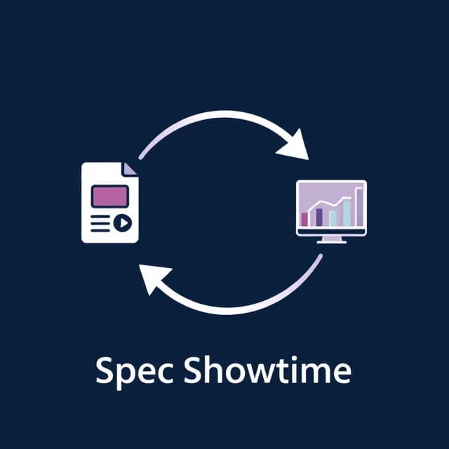
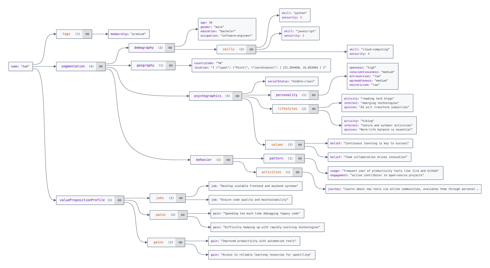
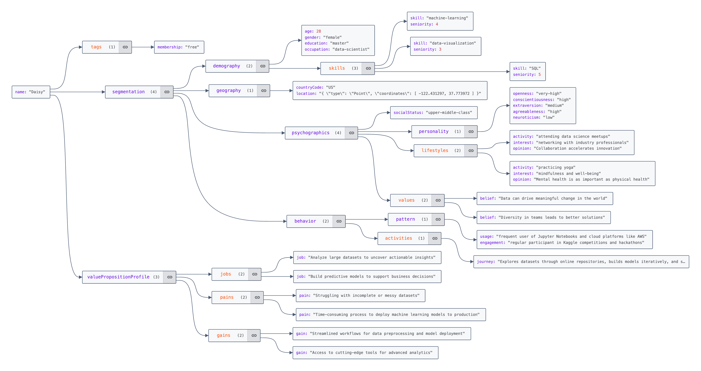
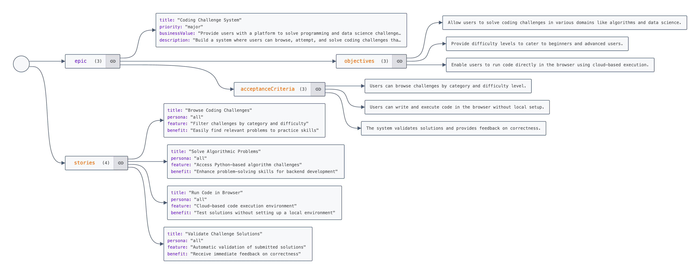
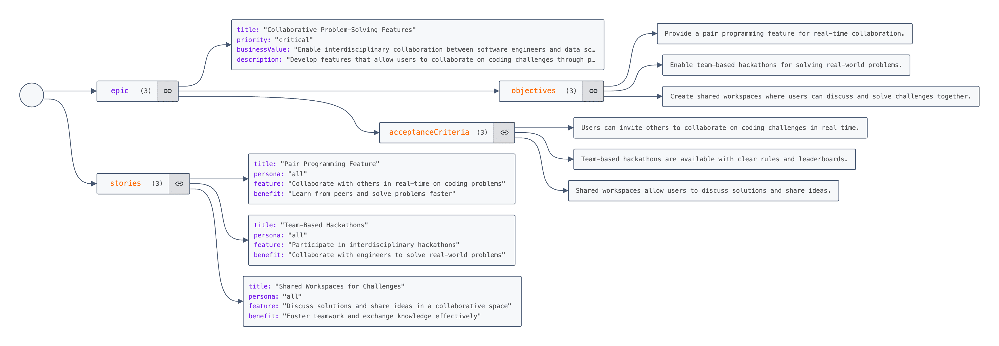
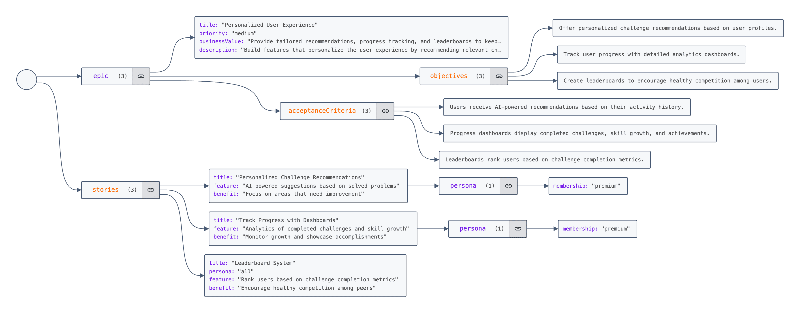
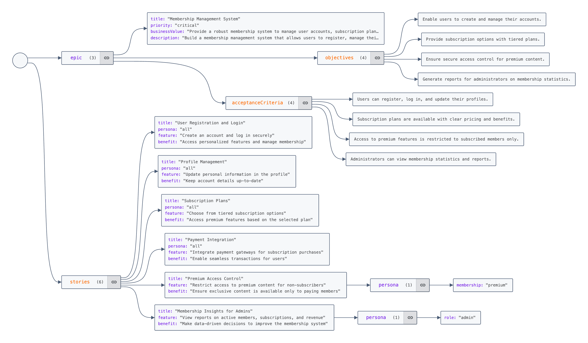

# SpecShowtime




> 'To be, or not to be, that is the question.'
>
> Deliver quality software from specification to showtime.

SpecShowtime is an ATDD/BDD/TDD framework demo for web testing and automation based on

- [Playwright]: Enables reliable end-to-end testing for modern web apps.
- [Playwright-BDD]: Run BDD tests with Playwright runner
- [Allure Report]: Automation test reporting tool
- [Next.js FastAPI Starter](https://github.com/digitros/nextjs-fastapi): Simple Next.js 14 boilerplate that uses FastAPI as the API backend.

### Why SpecShowtime?

- 📝 **Requirement Context**: SpecShowtime integrates requirement contexts like **personas** and **user stories** to refine product scope and enhance user experience.
- 🤖 **AI Copilot**: On top of that, AI Copilot can assist in generating precise test cases and code.

<!-- TOC -->
* [SpecShowtime](#specshowtime)
    * [Why SpecShowtime?](#why-specshowtime)
  * [Structure](#structure)
  * [Flow](#flow)
  * [Sample - SpecChampion (under construction)](#sample---specchampion-under-construction)
    * [Persona](#persona)
    * [Epic & User Story](#epic--user-story)
  * [AI Prompts](#ai-prompts)
    * [1. Generating feature from userstory.yaml](#1-generating-feature-from-userstoryyaml)
    * [2. utilize `npx bddgen` to generate step implementation](#2-utilize-npx-bddgen-to-generate-step-implementation)
    * [3. use AI prompts again to implement steps](#3-use-ai-prompts-again-to-implement-steps)
    * [Others: Icon Prompt](#others-icon-prompt)
  * [Contribute](#contribute)
<!-- TOC -->

## Structure

```text
app/    # your main code
tests/  # your tests, playwright: *.spec.ts
playwright.config.ts    # playwright config
spec/
├── persona/*.yaml    # persona definition
├── userstory/*.yaml  # epic & user story definition
├── .spec-gen/
│   ├── features/*.feature.spec.js  # given features/, generated by playwright-bdd
│   └── issues/*.json   # given features/
├── features/*.feature  # gherkin syntax. Scenario: Given-When-Then
│   ├── step/*.js|ts    # step implementation
├── reports/
│   └── test-results/   # given tests/ & features/step/, generated by playwright
│   └── allure-results/ # given tests/ & features/step/, generated by playwright
│   ├── playwright-report/index.html  # given test-results/, generated by playwright
│   ├── allure-report/index.html      # given allure-results/, generated by allure
```

## Flow

Requirement (Persona + User Story) -> Feature (Ticket) -> Step -> Test -> Code -> Report

- Write requirements
  - Persona
    - segmentation, value proposition profile
    - outputDir: `./spec/persona/*.yaml`
  - User Story
    - outputDir: `./spec/userstory/*.yaml`
- Write features
  - Given `persona/` and `userstory/`
  - outputDir: `./spec/.spec-gen/features/*.feature`
  - Format: Gherkin syntax `Scenario + Given-When-Then`
- Implement steps in JavaScript
  - Auto generate by [Playwright-BDD]: `npx bddgen`, outputDir: `./spec/.spec-gen/*.features.step.js`
  - Auto generate by [Playwright]: `npx playwright codegen`. recording to `./tests/*.spec.ts`
- Run tests & Check the Allure HTML report
  - run `pnpm spec:e2e-show`. outputDir: `./spec/reports/allure-report`

## Sample - SpecChampion (under construction)

SpecChampion is a LeetCode-like skill-learning website for software engineers.

Check details at [spec/spec.md](spec/spec.md)

### Persona

- image generated by [Json Crack](https://jsoncrack.com/editor)






### Epic & User Story









## AI Prompts

### 1. Generating feature from userstory.yaml

~~~text
for BDD development, generate multiple *.feature in Gherkin syntax as the following and include feature-filename as dash-case:

`${feature-filename}.feature`


```gherkin
feature content in Gherkin syntax
```

given the userstory.yaml as following

```yaml
${{ your real userstory.yaml }}
```
~~~

### 2. utilize `npx bddgen` to generate step implementation

- [Playwright-BDD - Using ChatGPT](https://vitalets.github.io/playwright-bdd/#/writing-features/chatgpt)

### 3. use AI prompts again to implement steps

### Others: Icon Prompt

- Refined by [Perplexity.AI](https://www.perplexity.ai/)
- Generated by [DeepAI AI Image Generator](https://deepai.org/machine-learning-model/text2img)

```gh
- Image: A logo of "Spec Showtime"
- Concept: Expressing software delivery by test automation from specification to  code
- Style: modern, flat, simple
```

```prompt
- Design a modern, flat, and simple logo for "Spec Showtime" that visually represents the concept of software delivery for a website through test automation.

- The logo should visually depict the transformation process:
  - On the left side, use an icon of a specification document featuring a play button at its center to symbolize "showtime" and delivery.
  - On the right side, use an icon of charts to represent website reports and outcomes.
  - Connect these two icons with two curved arrows forming a circular infinite feedback loop:
    - The top arrow should curve from left to right, indicating forward progression.
    - The bottom arrow should curve from right to left, indicating feedback or iteration.

- The design must feel dynamic, innovative, and professional, utilizing clean lines and a flat aesthetic.

- Place the text "Spec Showtime" neatly at the bottom of the logo.
```

## Contribute

* [LICENSE](LICENSE)
* [CODE_OF_CONDUCT](CODE_OF_CONDUCT.md)
* [CONTRIBUTING](CONTRIBUTING.md)

<a href="https://github.com/androchentw/specshowtime/graphs/contributors">
  
</a>

Made with [contrib.rocks](https://contrib.rocks).

<!-- Links -->

[Playwright]: https://github.com/microsoft/playwright

[Playwright-BDD]: https://github.com/vitalets/playwright-bdd

[Allure Report]: https://github.com/allure-framework/allure2
